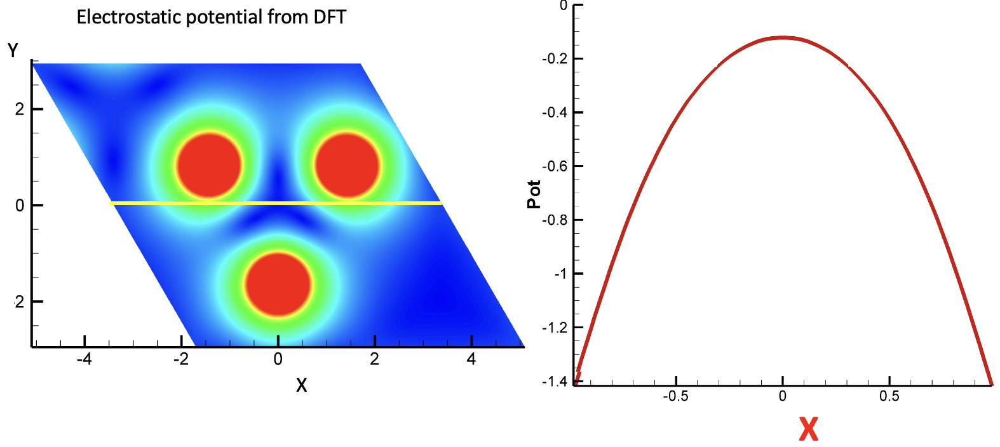

# ELPOT

Program ELPOT reads the potential created by Quamtum Espresso, VASP, or Materials Studio and plot the potential in defined pathways or in 3D box using spline smoothing. The program also calculates spherical harmonic expansion coefficients and Stevens coefficients.

## Installation

The program uses SHTOOLS library for shperical harmonics analysis. To install SHTOOLS follow https://github.com/Dmitry-Skachkov/SHTOOLS_examples 

After installation of SHTOOLS correct the [makefile](src/makefile) with the directory of installed library and compile the program

> make

## Example

Run the program

> elpot d.elpot0.xsf

